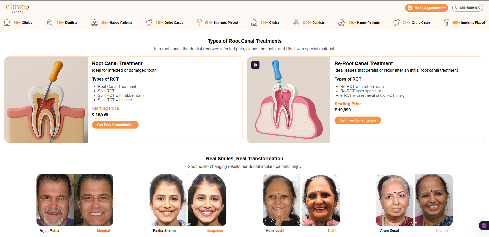
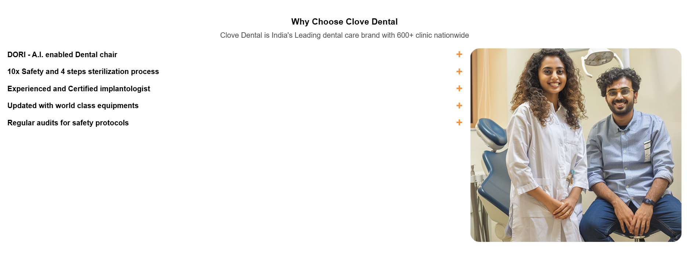
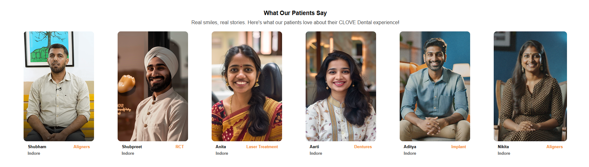
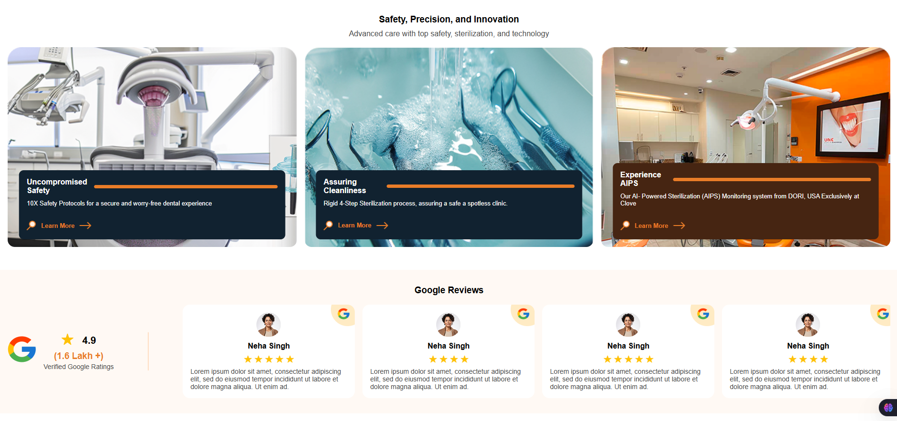
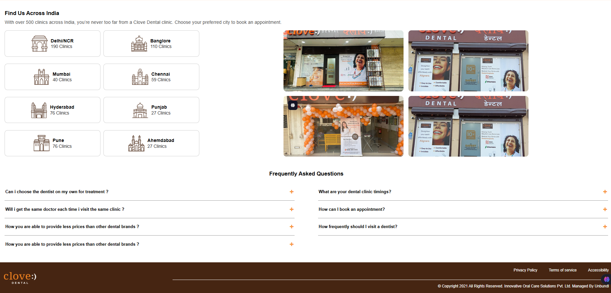

# Clove Dental

<h2>Live Link of the Project : <a href='https://clove-dental-omega.vercel.app'>Link</a></h2>

<h2>These are the Images of a Project</h2>

 

<h2>Technologies Used</h2>
<li>HTML</li>
<li>CSS</li>
<li>JavaScript</li>
 

<h2>About the Project</h2>

This project is a clone of the homepage design from Clove Dentist, created using Figma. The goal of this project is to replicate the UI design as closely as possible using HTML, CSS, and JavaScript.

